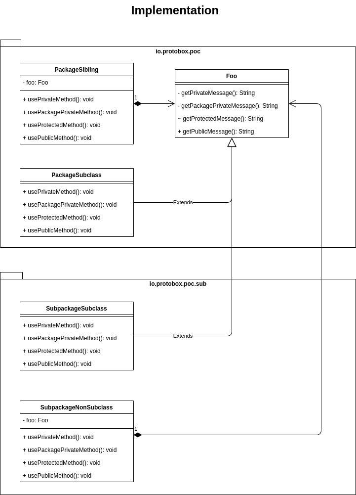
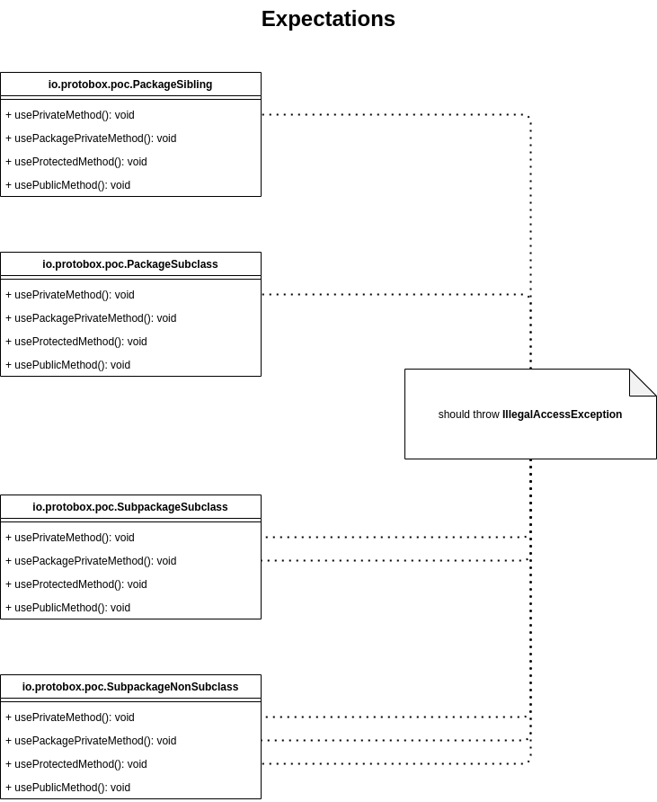
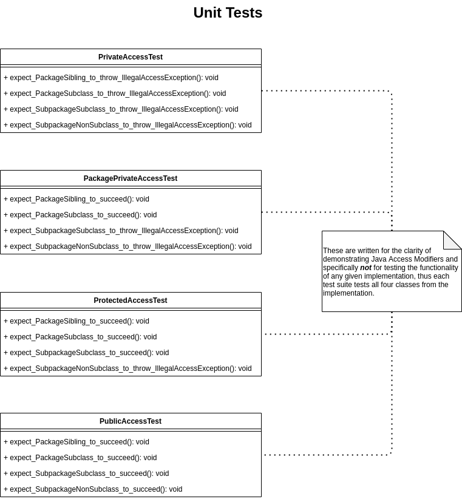

# Proof-of-Concept for Java Access Modifiers

The Mandella effect strikes again. 

Recently, I found out that there are *four* Java access level modifiers, not 
*three*. Apparently there is (and has been) a "Package Private" access level,
which is only accessible by a class and other classes within the package. 

## Goal
Use unit tests to demonstrate the four access levels outlined in the 
[Java tutorial on access control][1]
1. **Public** - should be accessible by world
2. **Protected** - should only be accessible by subclasses and other classes 
in the same package
3. **Package-Private** - should only be accessible by classes in the same 
package
4. **Private** - should only be accessible by its own class

## Theory of Operation
Since the Java compiler cowardly refuses to proceed if it detects such an 
access violation, access must be attempted at runtime, so Java reflection is
used to access the various methods.

## The Implementation
There are four Java access levels, so each access level should be tested 
against the following factors:
1. Various package levels (e.g. "same" versus "subpackage")
2. Various structural relationships (e.g. "has-a" versus "is-a"; 
siblings/nonsubclasses versus subclasses)

It is my opinion that the Java tutorial on access control is unclear about 
whether the access control is achieved via an "opting in" or "opting out" 
paradigm. At the risk of admitting that I adjusted a particular test according 
to the results of experimentation, I used a subclass in the same-package 
(PackageSubclass) to test how a package-private access level should behave. 
In an "opt-out" scenario, a subclass in the same package would not be able to 
access a package-private member since the access level chart provided by Sun 
indicates that subclasses don't have access to package-private members. In an 
opt-in scenario, a subclass would be able to access a package-private member 
as long as it's in the same package. The results: "opt-in" 

Here is the hybrid class & package diagram of the implementation:

## The Expectations

Here is a structural visualization of expected results given the Java access 
level explanation with respect to the reflection-based implementation:

## The Unit Tests
Here is a class diagram of the unit tests based on the expectations diagram:

## Conclusion
Java's access level modifiers work as advertised, but I hope I never encounter 
package-private modifiers in the wild.

[1]: https://docs.oracle.com/javase/tutorial/java/javaOO/accesscontrol.html "Controlling Access to Members of a Class"
